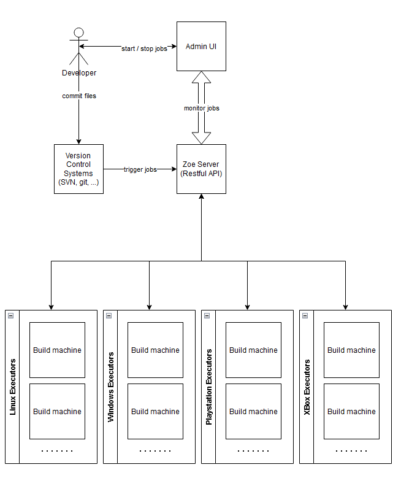
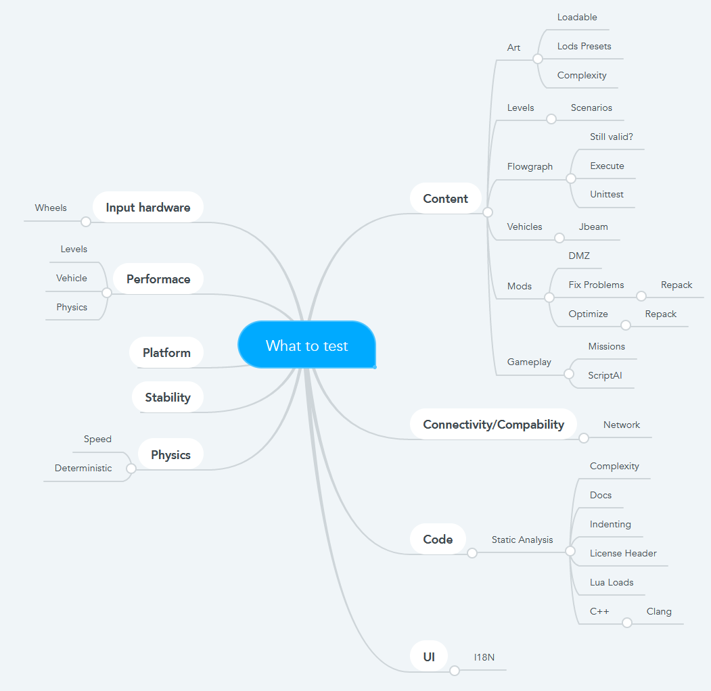
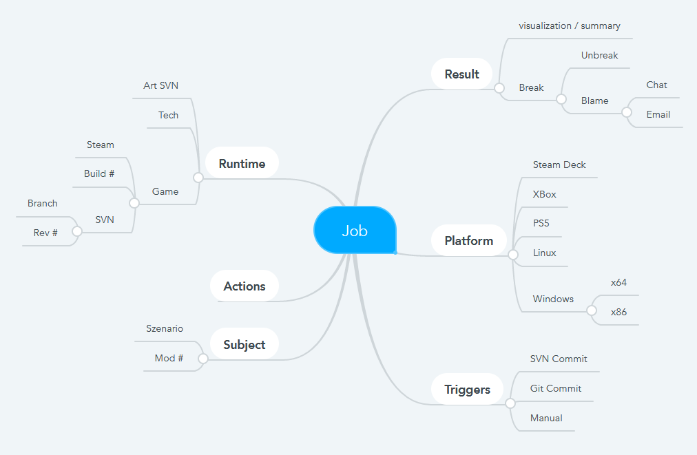
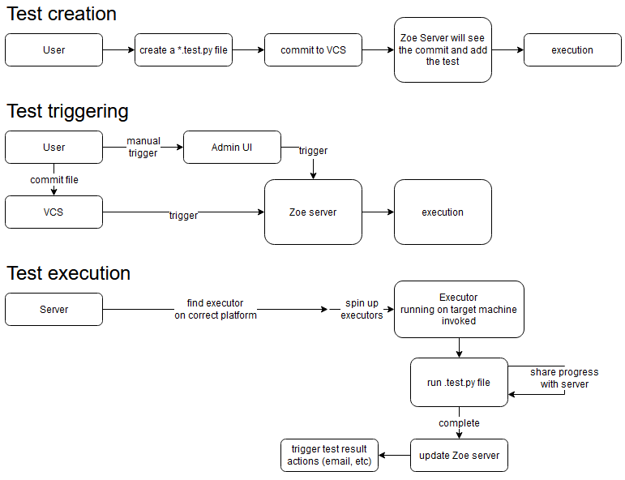

# Zoe Architecture

*Zoe* is the testing/job infrastructure for BeamNG being in development since Oct 2021.

It should allow anyone to write work items that are executed on target machines upon events or regular intervals.

Example use cases:
* Test if game still starts after a commit
* Record performance metrics of certain vehicles (content)
* Generate LODs for certain assets upon changes of the source file
* check syntax of committed scripting (lua) files upon commit

## Terms / Glossary

* **Zoe**: Name of the framework. Not an abbreviation. Short name, easy to remember. Test Server / Testing server is far too confusing.
* **Job / Task / Test**: An work item that needs to be computed on a machine more than one time. The term Test is a Job with the results being checked. Use the term Job to keep it generic as possible.
* **Executor / build machine**: The target machine where the job is executed.
* **VCS**: Version Control System, think of Subversion or Git

## Overview

## What to test

## How to test

## Testing flowchart

## Vision / Goals

* [KISS](https://en.wikipedia.org/wiki/KISS_principle)
* Simple architecture
* Simple building blocks
* Easy to maintain, easy to get into the topic, no steep learning curve
* Easy to extend
* Test code will be beside the things to test in the same VCS
* The test will describe what to test, how to test and what to do with the results completely
* Ability to run the tests locally with no additional effort required
* No need to learn yet another [DSL](https://en.wikipedia.org/wiki/Domain-specific_language) to get the job done
* Realtime feedback on jobs no matter where they are or what is running
* Fast framework with minimal overhead

## Technological requirements / high level use cases

* Easy to create/maintain/monitor existing tests/jobs
* Easy user interface to monitor progress and state

# FAQ's

## Why yet another framework?

A simpler approach to solve the overall problem

## Why not jenkins?

* Huge machinery of moving parts
* Huge upfront knowledge required to create/maintain/monitor jobs: Jenkins, permissions, Groovy script, Pipeline scripts
* Every part of the architecture needs its own VCS
* Architecture spread across several services and repositories making it extremely complex
* Jenkins is written in Java and is not easily extensible

## Why python?

Python is the de-facto language for glueing things things together in a lot of industries. It's easy to learn and get productive in no time.

## How to start using Zoe?

You need to start writing tests with the Zoe Python framework. See the [examples](examples) folder to get started.

If Zoe is setup correctly, you should just commit a `.job.py` (or `.test.py`) file to your version control system of choice and things should be set in motion from there automatically :)

## How to develop Zoe?

Currently there are three components:
* The executor client and python library: [Zoe](client/)
  * You need to learn this to write jobs/tests
* The API backend that serves the clients and the user interface: [api-backend](server/api-backend)
  * This is the backend that communicates with the executors and the UI
* The admin user interface : [admin-ui](server/admin-ui)
  * Overview of what is happening on the server

## Why are all components in the same git repository?

All components need to use the same API, thus it makes sense to bundle them closely together.